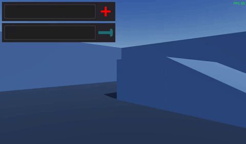

# Godot's Advanced 3D Controller*

## Summary and Credits
This repo is a project meant to be an improvement to the @Whimfoome's [godot-FirstPersonStarter](https://github.com/Whimfoome/godot-FirstPersonStarter "godot-FirstPersonStarter").

## Improvements
The idea is to add or improve the following elements:

| Feature  | Added  |
| :------------ | :------------ |
| Sprinting | ✅ |
| UI System | ✅ |
| Shader System | ❎ |
| Animations | ❎ |

and other things I come up with!

## Implementation
Currently, you can use this repo as a Godot project, although I intent to have this project use only a TSCN for the player and the necessary scripts.
